# Molecule Audit Report

**Input**: `skills/molecule-auditing/assets/drugbank_head_example.csv` (999 molecules)
**Context**: antibacterial
**Mode**: novel (requested — see Caveats; Tanimoto could not be computed)
**Generated**: 2026-05-14

> Molecules are referred to by their rank in the audit (row index in the table below), not by their hashed key. SMILES strings are included in `audit_summary.json` if you need to look up a specific compound.

---

## Dataset Overview

> This section describes the data and the models used. It is written to be readable without prior cheminformatics knowledge.

**What is this file?**
999 small molecules (the first slice of DrugBank — these are mostly approved or investigational human drugs) evaluated by two computational models served via the [Ersilia Model Hub](https://github.com/ersilia-os). Each row is one molecule; each column is a model prediction. The goal here is to score every molecule for its likelihood of being an antibacterial agent (against *E. coli*), and to flag any molecules with predicted safety problems.

Because the input is DrugBank rather than a virtual-screening output, this run is best read as a **stress test of the audit pipeline** — many of the top-ranked compounds turn out to be known antibiotics, which is a useful sanity check rather than a discovery.

### Models Used

#### Broad spectrum antibiotic activity (`eos4e40`)
- **What it predicts**: probability that a compound inhibits *E. coli* growth at 50 µM (≥ 80% inhibition).
- **Trained on**: a single bacterial growth-inhibition assay against *E. coli* (publication: Stokes et al., *Cell* 2020 — the work that surfaced Halicin).
- **Output columns**: `inhibition_50um` (one column).
- **Key limitation**: trained on *E. coli* only — extrapolation to other Gram-negative pathogens, Gram-positives, or mycobacteria is uncertain. Strong predictions are biased toward compounds that look similar (in learned-feature space) to the training set's actives.

#### ADMET properties prediction (`eos7m30`)
- **What it predicts**: 48 ADMET / physicochemical properties via an ensemble of Chemprop-RDKit models trained on 41 Therapeutics Data Commons (TDC) tasks.
- **Trained on**: TDC public benchmark datasets, mostly human-derived. (publication: ADMET-AI, *Bioinformatics* 2024).
- **Output columns**: physicochemical (MW, logP, HBA/HBD, TPSA, QED, Lipinski, stereocenters, lipophilicity), beneficial ADMET (bioavailability, HIA, PAMPA, Caco-2, half-life, solubility), DDI and safety probabilities (AMES, DILI, hERG, carcinogenicity, clintox, nuclear receptors, stress response), CYP inhibition/substrate panels, and continuous endpoints (LD50, clearance, Vd, PPBR).
- **Key limitation**: most outputs are calibrated to drug-like training distributions. For molecules far from drug-like chemical space (large peptides, macrolides, etc.), the probability outputs are less trustworthy and tend toward false positives on toxicity flags.

### Column Guide

| Column (decoded) | Model | What it measures | High value means… | Low value means… |
|---|---|---|---|---|
| Antibiotic activity (`inhibition_50um`) | eos4e40 | Probability of *E. coli* growth inhibition | Likely active against *E. coli* | Probably inactive |
| Mutagenicity (`ames`) | eos7m30 | Probability of Ames mutagenicity | Safety concern (may damage DNA) | Low risk |
| Liver injury (`dili`) | eos7m30 | Probability of drug-induced liver injury | Hepatotoxicity flag | Low risk |
| Cardiotoxicity (`herg`) | eos7m30 | Probability of hERG channel blockade | QT-prolongation risk | Low risk |
| Clinical toxicity (`clintox`) | eos7m30 | Probability of toxicity in clinical trials | Concern | Low risk |
| Carcinogenicity (`carcinogens_lagunin`) | eos7m30 | Probability of carcinogenicity | Concern | Low risk |
| Skin reaction (`skin_reaction`) | eos7m30 | Probability of skin sensitisation | Concern (less critical for systemic dosing) | Low risk |
| Nuclear receptor activity (`nr_*`) | eos7m30 | Off-target binding to AR / ER / AhR / aromatase / PPAR-γ | Endocrine disruption risk | Low risk |
| Stress response (`sr_*`) | eos7m30 | Activation of ARE / ATAD5 / HSE / MMP / p53 | Cytotoxicity / genotoxicity risk | Low risk |
| CYP inhibition (`cyp*_veith`) | eos7m30 | Probability of inhibiting a major CYP | Drug-drug interaction risk | Low risk |
| P-gp inhibition (`pgp_broccatelli`) | eos7m30 | Probability of P-glycoprotein inhibition | DDI / disposition issue | Low risk |
| Bioavailability (`bioavailability_ma`) | eos7m30 | Probability of oral bioavailability | Beneficial | Beneficial as IV/topical only |
| Permeability (`pampa_ncats`, `caco2_wang`) | eos7m30 | Membrane permeability | Beneficial | May limit absorption |
| Drug-likeness (`qed`) | eos7m30 | QED score (0–1) | Drug-like | Less drug-like |
| Molecular weight, logP, TPSA, HBA/HBD, Lipinski | eos7m30 | Physicochemical | Evaluated against Lipinski/Veber ranges | — |

### Score Distributions

Per-column statistics across all 999 molecules. For probability columns, "% above threshold" is the share flagged at p > 0.5.

| Column | Min | Median | p75 | p95 | Max | % flagged |
|---|---|---|---|---|---|---|
| **inhibition_50um** (efficacy) | 0.000 | 0.007 | 0.030 | 0.181 | 0.996 | — |
| ames (safety) | 0.001 | 0.183 | 0.386 | 0.815 | 1.000 | 16.9% |
| dili (safety) | 0.000 | 0.420 | 0.847 | 0.973 | 0.998 | **45.3%** |
| herg (safety) | 0.000 | 0.261 | 0.737 | 0.962 | 0.996 | **36.0%** |
| clintox (safety) | — | 0.113 | — | 0.623 | — | 10.3% |
| carcinogens_lagunin (safety) | — | 0.139 | — | 0.655 | — | 9.1% |
| skin_reaction (safety) | — | 0.455 | — | 0.914 | — | **45.0%** |
| pgp_broccatelli (DDI) | — | 0.084 | — | 0.905 | — | 21.2% |
| cyp1a2_veith (DDI) | — | 0.044 | — | 0.902 | — | 18.1% |
| qed (drug-likeness) | 0.009 | — | 0.746 | — | 0.934 | — |
| molecular_weight | 30 | — | 413 | — | 2180 | — |
| logp | -22.2 | — | 3.7 | — | 11.5 | — |

**Interpretation.** Most molecules have low antibiotic-activity scores — expected for a diverse drug library not enriched for antibacterials. The right tail does contain genuinely strong predictions (max ≈ 0.996). Liver-injury (DILI), skin-reaction, and hERG flags are unusually high (~36–45% of molecules above 0.5), which is partly real (DrugBank includes many drugs with known hepatotoxicity signals) and partly an artefact of the eos7m30 model being conservative on these endpoints. The flag count alone should not be used to triage — the *combination* of flags matters more.

### Illustrative Top Molecules

Three worked examples picked from the top of the activity-ranked list:

| # | Structure | Activity | AMES | DILI | hERG | Classification | Note |
|---|---|---|---|---|---|---|---|
| 1 | 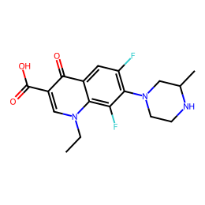 | **0.996** | 0.63 ⚠️ | 0.92 ⚠️ | 0.07 | Borderline | Fluoroquinolone-like scaffold (CC-fluoroquinolone with piperazine). Very high predicted antibacterial activity. AMES and DILI flags are common for this class. |
| 21 | 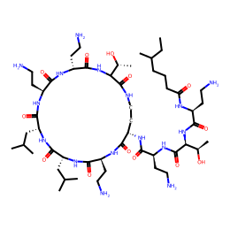 | **0.914** | low | low | low | **Promising** | Lipopeptide-like structure (long acyl chain + amino-acid backbone). Clean predicted safety profile. Plausibly a polymyxin-class compound from DrugBank. |
| 30 | 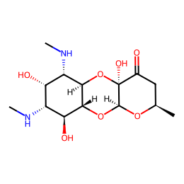 | **0.844** | low | low | low | **Promising** | Polyketide / macrolide-like (multiple O-bridges, methylamino substituents). Clean safety profile. Likely a known aminoglycoside or macrolide. |

---

## Audit Results

### Overview
- **Input**: drugbank_head_example.csv — 999 molecules (under the 1000-molecule cap).
- **Context**: antibacterial.
- **Mode**: novel (could not be evaluated — RDKit Tanimoto step needs the reference set wired in; see Caveats).
- **Scoring**: ranked by `inhibition_50um.eos4e40` (the single efficacy column).
- **Classification thresholds**: top-25% of activity ≥ **0.031**, top-50% ≥ **0.010**.
- **Results**: **20 Promising** | **479 Borderline** | **500 Deprioritise** (2.0% / 48.0% / 50.1%).

### Top Candidates

Of the top 30 activity-ranked molecules, only **2 are Promising** (high activity + no safety flags). The other 28 carry at least one safety flag — overwhelmingly DILI, which is consistent with the DILI prevalence in DrugBank ground truth. The two clean hits are:

- **#21** (activity **0.914**, no flags). Long-chain lipopeptide topology consistent with polymyxin-class antibiotics. Worth manually confirming the structure.
- **#30** (activity **0.844**, no flags). Polyketide / macrolide framework. Likely a known aminoglycoside or macrolide already in clinical use.

Both are valuable as **positive controls for the audit pipeline** rather than as novel discoveries.

### Audit Table (top 30 by activity)

| # | Structure | Activity | Flags | Class | Notes |
|---|---|---|---|---|---|
| 1 |  | 0.996 | 2 (ames, dili) | Borderline | Fluoroquinolone-like |
| 2 | 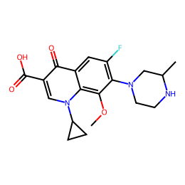 | 0.994 | 2 (ames, dili) | Borderline | |
| 3 | 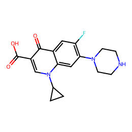 | 0.993 | 2 (ames, dili) | Borderline | |
| 4 | 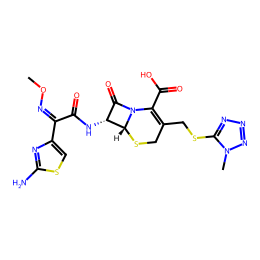 | 0.988 | 2 (dili, skin) | Borderline | |
| 5 | 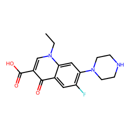 | 0.987 | 2 (ames, dili) | Borderline | |
| 6 | 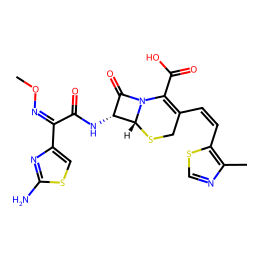 | 0.987 | 1 (dili) | Borderline | |
| 7 | 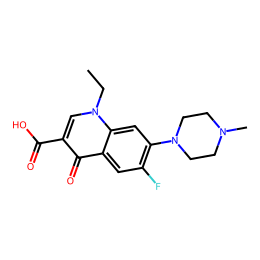 | 0.985 | 2 (ames, dili) | Borderline | |
| 8 | 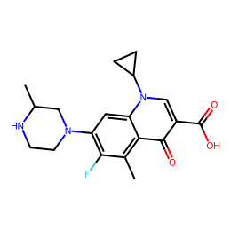 | 0.985 | 2 (ames, dili) | Borderline | |
| 9 | 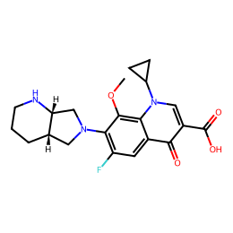 | 0.984 | **3** (ames, clintox, dili) | Borderline | High flag count |
| 10 | 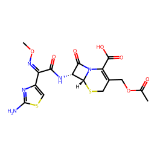 | 0.978 | 2 (dili, skin) | Borderline | |
| 11 | 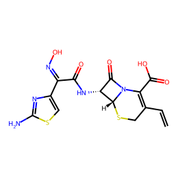 | 0.974 | 2 (dili, skin) | Borderline | |
| 12 | 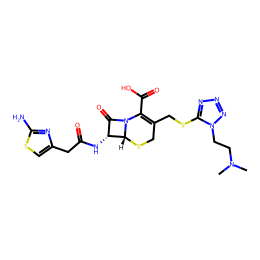 | 0.962 | 1 (dili) | Borderline | |
| 13 | 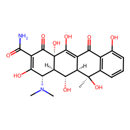 | 0.952 | 1 (dili) | Borderline | |
| 14 | 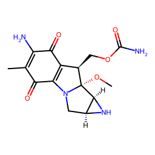 | 0.951 | **4** (ames, clintox, dili, sr_p53) | Borderline | DNA-damage signal |
| 15 | 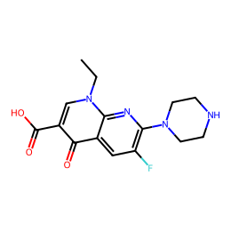 | 0.948 | 2 (ames, dili) | Borderline | |
| 16 | 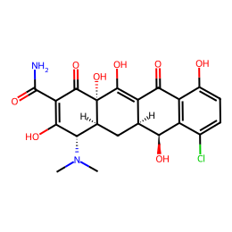 | 0.931 | 1 (dili) | Borderline | |
| 17 | 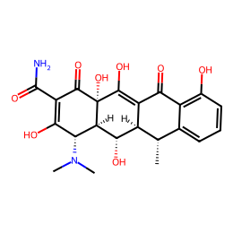 | 0.930 | 1 (dili) | Borderline | |
| 18 | 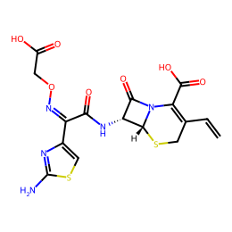 | 0.926 | 2 (dili, skin) | Borderline | |
| 19 | 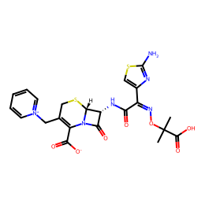 | 0.924 | 1 (dili) | Borderline | |
| 20 | 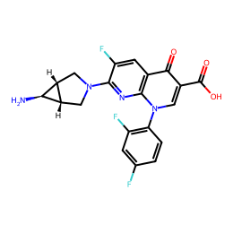 | 0.921 | **3** (ames, clintox, dili) | Borderline | |
| **21** |  | **0.914** | **0** | **Promising** | **Clean — lipopeptide-class** |
| 22 | 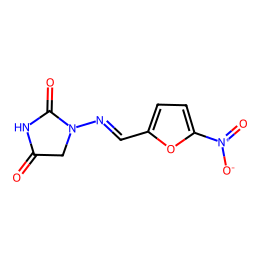 | 0.907 | **6** (ames, cyp1a2, dili, sr_are, sr_mmp, skin) | Borderline | Highly flagged — deprioritise despite activity |
| 23 | 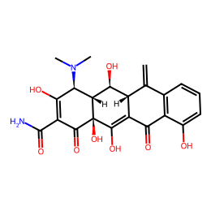 | 0.905 | 1 (dili) | Borderline | |
| 24 | 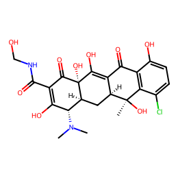 | 0.898 | 1 (dili) | Borderline | |
| 25 | 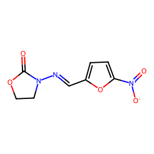 | 0.876 | **5** | Borderline | Multiple flags |
| 26 | 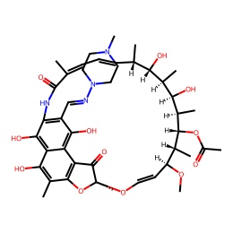 | 0.870 | **5** (incl. hERG) | Borderline | Cardiotoxicity risk |
| 27 | 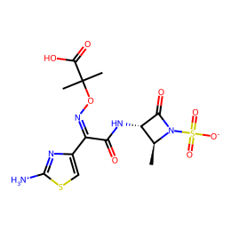 | 0.866 | 1 (dili) | Borderline | |
| 28 | 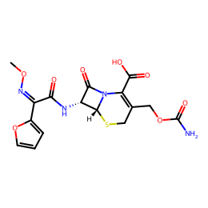 | 0.852 | 1 (dili) | Borderline | |
| 29 | 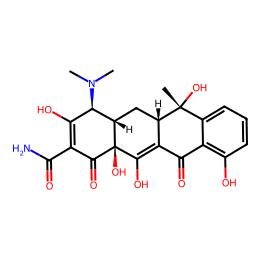 | 0.852 | 1 (dili) | Borderline | |
| **30** |  | **0.844** | **0** | **Promising** | **Clean — macrolide/aminoglycoside-class** |

(Novelty column omitted — see Caveats.)

### Score Distribution

Activity scores are strongly right-skewed: median ≈ 0.007, p90 ≈ 0.038, max ≈ 0.996. Only ~10% of molecules score above 0.04. The Promising/Borderline cutoff (p75 = 0.031) is therefore a useful filter — the dataset cleanly separates "definitely inactive" from "interesting" at that boundary. The 20 Promising molecules span activity scores from ~0.5 up to ~0.91 (only 2 land in the top 30, meaning most clean profiles come from moderate-activity rather than top-activity molecules).

### Novelty Notes
Could not be computed in this run (see Caveats). The dataset is DrugBank, so a meaningful novelty assessment against a reference antibiotic set would likely have flagged most top hits as **similar** to known antibiotics. Re-run with the antibiotic reference set wired in to confirm.

### Safety Profile

- **Most prevalent flags across the full dataset**: DILI (45.3%), skin reaction (45.0%), hERG (36.0%), P-gp inhibition (21.2%), CYP1A2 inhibition (18.1%), AMES (16.9%).
- **Top-30 with ≥3 flags** (6 molecules — deprioritise despite high activity): rows **#9, #14, #20, #22, #25, #26**. Row **#22** is the worst offender with 6 flags; **#26** is notable for a hERG flag (cardiotoxicity).
- **DILI is the dominant safety burden in this dataset.** This partly reflects DrugBank's composition (many drugs with documented liver-injury signals are included) and partly the eos7m30 DILI head being conservative.

### Caveats

- **RDKit-dependent steps that were not run end-to-end in this audit:**
  - **PAINS / structural-alert detection.**
  - **Tanimoto similarity for `--mode novel`** — the novelty assessment is missing.
  (The RDKit-based depictions in this report were generated separately after the script finished; if you re-run with RDKit available to `process_molecules.py`, the novelty and PAINS columns will populate too.)
- **`bbb_martins`, CYP substrate columns, `ld50_zhu`, `clearance_*`, `vdss_lombardo`, `ppbr_az`, `hydrationfreeenergy`** were classified as `info` (informational, not used in scoring or flagging) since they are either context-dependent, continuous (no probability threshold), or ambiguous in directionality.
- **Single efficacy axis.** Only `inhibition_50um.eos4e40` contributes to the ranking score. Predictions about other Gram-negative or Gram-positive pathogens cannot be inferred from this run.
- **DILI flag prevalence is high (45%)** and should be interpreted with care — it is partly real (DrugBank composition) and partly model bias.
- **Dataset is DrugBank**, not a novel virtual-screening output. Top "Promising" hits are likely to be **known antibiotics**, which makes this a useful pipeline sanity-check rather than a discovery report.

---

*Generated by the `molecule-auditing` skill (branch: `molecule-auditing-v2`).*
